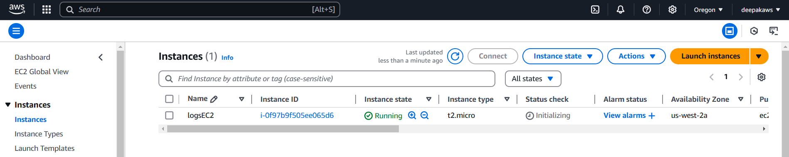
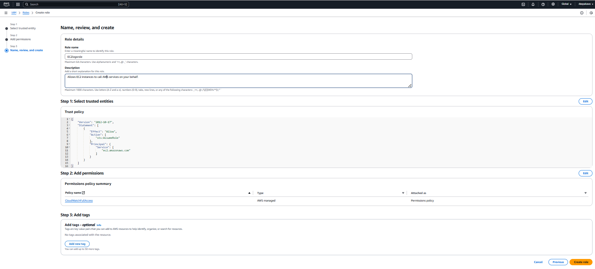
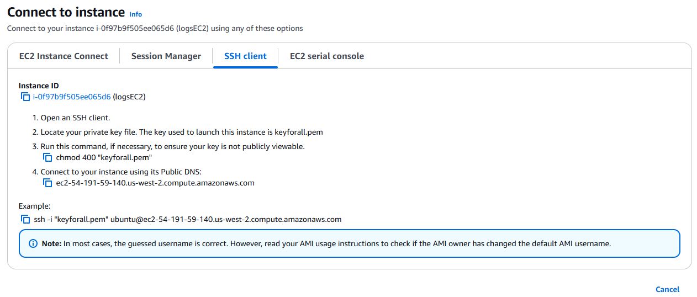
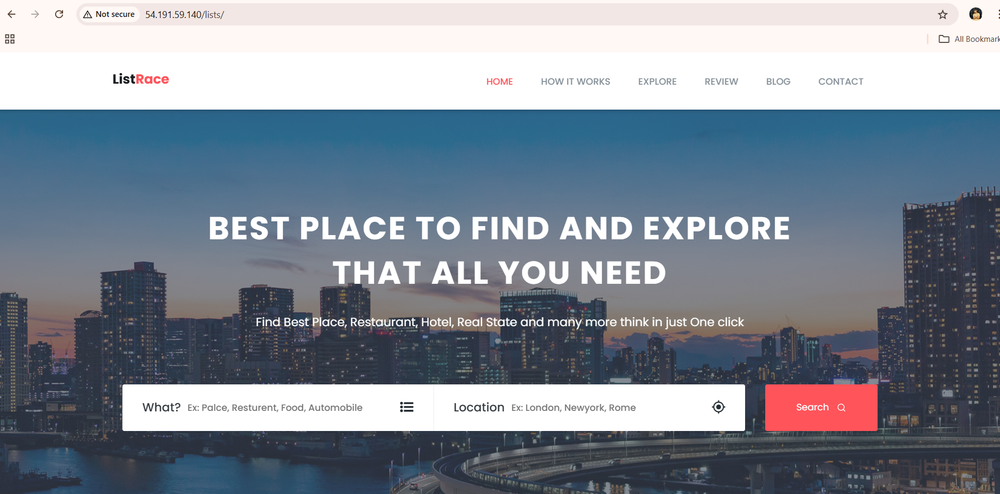

# EC2 with CloudWatch Logs and CSS Template Hosting

This project demonstrates setting up an EC2 instance to host a CSS template and send logs to CloudWatch.

---

## Prerequisites

- AWS Account
- IAM Role permissions assigned to EC2 for fullaccess on CloudWatch resources
- SSH client for connecting to the EC2 instance

---

## Steps

### Create EC2 Instance
1. Launch an Ubuntu instance.
2. Ensure the security group allows SSH (port 22) and HTTP (port 80).



### Create and Assign IAM Role
1. Create a role with the `CloudWatchFullAccess` attached.
2. Assign the role to the EC2 instance.



### Install CloudWatch Agent
1. SSH into the EC2 instance:
   ```bash
   ssh -i <your-key.pem> ubuntu@<instance-public-ip>
   ```



## Install the CloudWatch agent:
```bash
wget https://amazoncloudwatch-agent.s3.amazonaws.com/ubuntu/amd64/latest/amazon-cloudwatch-agent.deb
sudo dpkg -i amazon-cloudwatch-agent.deb
```
## Configure CloudWatch Agent
1. Create a CloudWatch log group /ec2/logs.
2. Add the following configuration to /opt/aws/amazon-cloudwatch-agent/etc/config.json:
```json

{
  "logs": {
    "logs_collected": {
      "files": {
        "collect_list": [
          {
            "file_path": "/var/log/syslog",
            "log_group_name": "EC2logs",
            "log_stream_name": "{instance_id}-syslog"
          }
        ]
      }
    }
  }
}
```
3. Start the agent:
```bash
sudo /opt/aws/amazon-cloudwatch-agent/bin/amazon-cloudwatch-agent-ctl \
  -a fetch-config \
  -m ec2 \
  -c file:/opt/aws/amazon-cloudwatch-agent/etc/config.json \
  -s
```
## Host a CSS Template
1. Install nginx and download the template

```bash
sudo apt update
sudo apt install nginx unzip -y
cd /tmp
wget https://www.free-css.com/assets/files/free-css-templates/download/page296/listrace.zip
unzip listrace.zip
sudo mv listrace-v1.0/ /var/www/html/
sudo mv /var/www/html/listrace-v1.0 /var/www/html/lists
```
2. restart nginx
 
```bash
sudo systemctl restart nginx
```
### Verify
Access the application at http://instance-public-ip/lists.
Check /ec2/logs in CloudWatch for system logs.

