# AWS EC2 Instance Setup and Application Deployment

This project guides you through the process of creating an AWS EC2 instance, installing necessary software, deploying an application, and accessing it through a web browser.

## Table of Contents
1. [Pre-requisites](#pre-requisites)
2. [Step 1: Create and Configure Security Groups](#step-1-configure-security-groups)
2. [Step 2: Create an EC2 Instance](#step-2-create-an-ec2-instance)
4. [Step 3: SSH into the EC2 Instance](#step-3-ssh-into-the-ec2-instance)
5. [Step 4: Install Required Software](#step-4-install-required-software)
6. [Step 5: Deploy the Application](#step-5-deploy-the-application)
7. [Step 6: Access the Application from Browser](#step-6-access-the-application-from-browser)
8. [Conclusion](#conclusion)

## Pre-requisites

Before you begin, ensure you have the following:
- An AWS account
- AWS CLI installed and configured
- Basic knowledge of AWS EC2, SSH, and application deployment

## Step 1: Create and Configure Security Group
  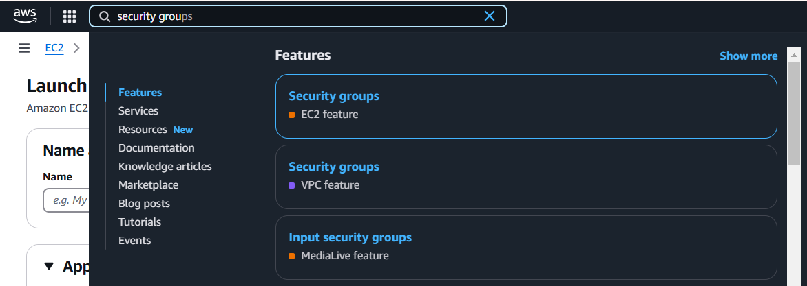
  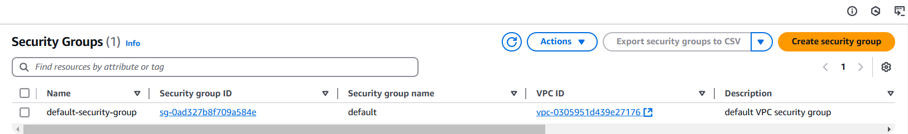

- Now, We can see only the default security group which is attached to the Defualt VPC
- Now, We need to create a security for our own inbound and outbound rules.


To allow inbound traffic for your application:

1. Go to **Security Groups** in the EC2 dashboard.
2. Select the security group for your EC2 instance.
3. Add rules to allow:
   - **SSH** (port 22) for accessing the instance
   - **HTTP** (port 80) for web access
   - **All traffic** for for all inbound access

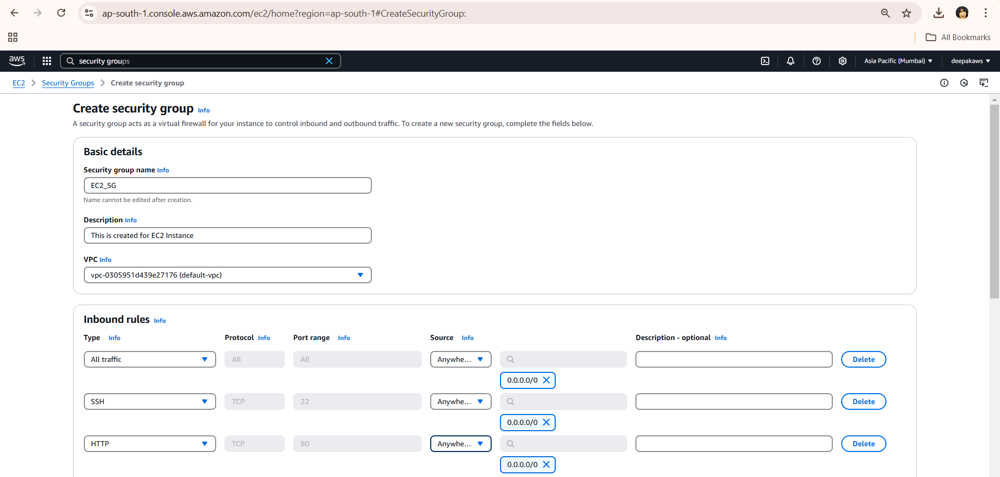
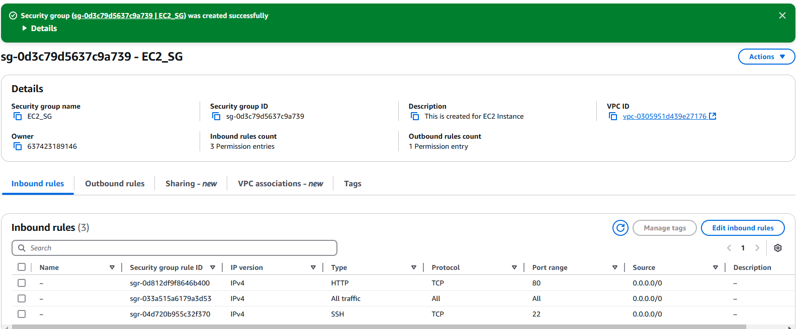
  


## Step 2: Create an EC2 Instance

Follow these steps to create a new EC2 instance:

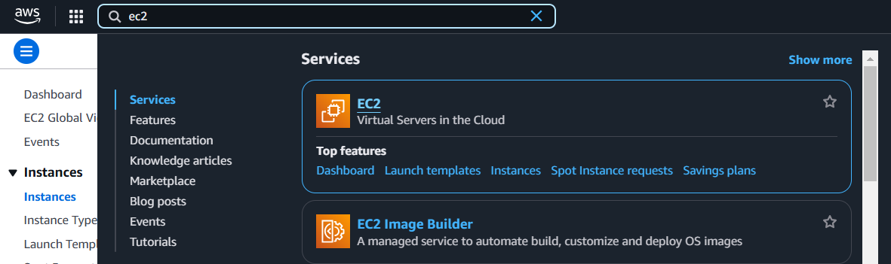
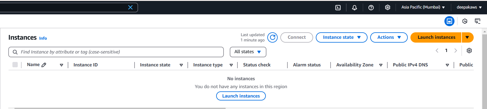


1. **Login to AWS Console**: Open the AWS Management Console and go to the EC2 Dashboard.
2. **Launch Instance**:
   - Click on **Launch Instance**.
   - Choose an **Amazon Machine Image (AMI)** (e.g., Ubuntu 20.04 LTS).
   - Select an **Instance Type** (e.g., t2.micro for free tier).
   - Configure instance details as needed.
3. **Configure Storage**: Choose default storage or configure as required.
4. **Configure Security Groups**:
   - Add a rule to allow HTTP (port 80), HTTPS (port 443), and SSH (port 22).
5. **Review and Launch**:
   - Review the configuration and click **Launch**.
   - Download the **key pair** (PEM file) for SSH access.


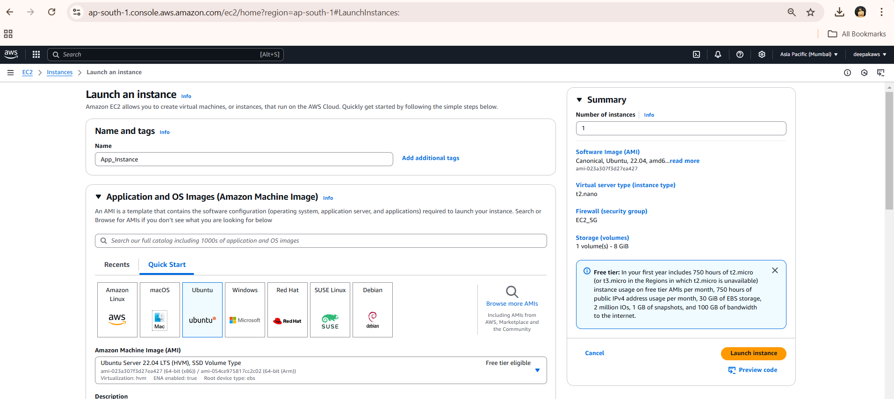
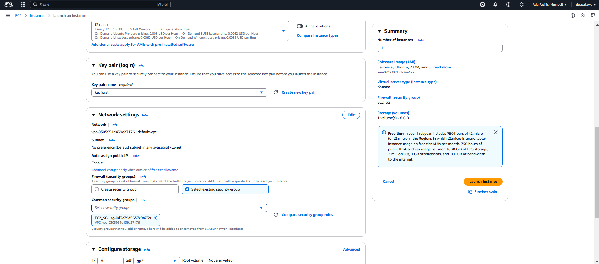
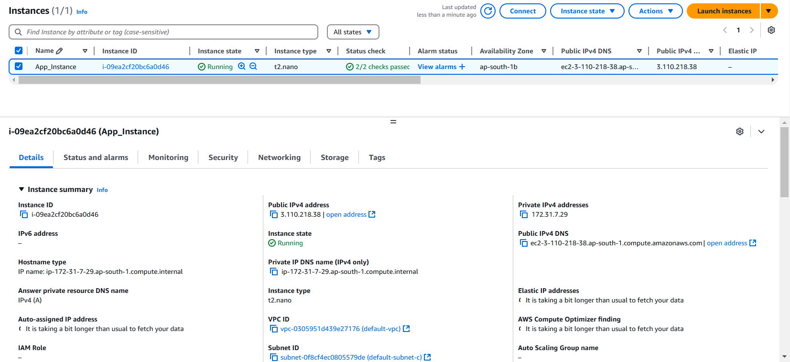

## Step 3: SSH into the EC2 Instance

To access your EC2 instance:

1. Open a terminal and navigate to the folder containing your `.pem` key file.
2. Run the following command to SSH into the instance:


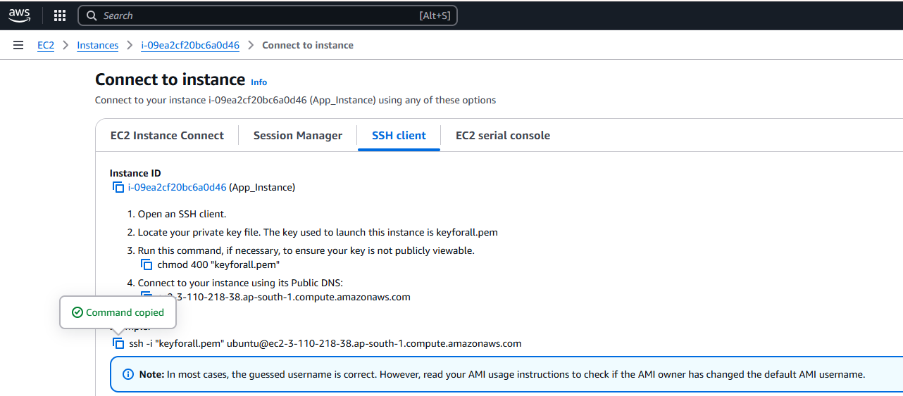
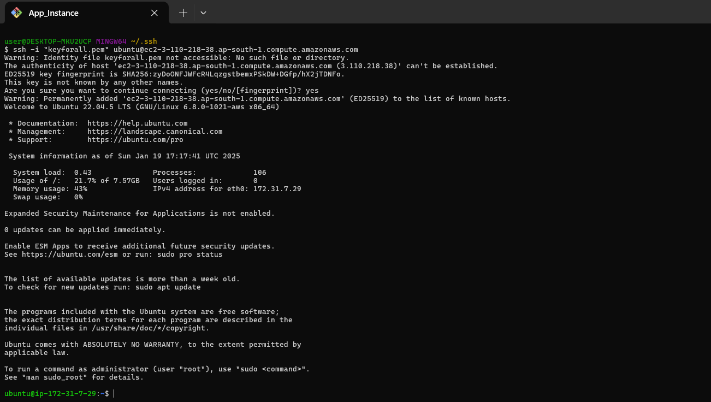


Once connected, you'll be in the EC2 instance terminal.

## Step 4: Install Required Software


1. Update the package list:

     ```bash
         sudo apt update
    ```

2. install unzip tool
  
    ```bash
       sudo apt install unzip -y
    ```
  
3. Install Nginx:

    ```bash
      sudo apt install nginx -y
    ```
4. Start Nginx:

    ```bash
       sudo systemctl start nginx
    ```
5. Verify that Nginx is running:

    ```
        sudo systemctl status nginx
    ```

## Step 5: Deploy the Application

To deploy a basic web application:

1. go to the directory /tmp

    ```bash
        cd /tmp
    ```
2. Upload your application files to the directory
    ```bash
        wget https://www.free-css.com/assets/files/free-css-templates/download/page292/grandcoffee.zip
    ```

3. unzip the folder

    ```bash
         unzip grandcoffee.zip 
    ```

4. move the content to /var/www/html/new_foldername

    ```bash
        mv html /var/www/html/deepakAPP
    ```
  

5. Restart Nginx:

  
    ```bash
       sudo systemctl restart nginx
    ```

## Step 6: Access the Application from Browser
 Now, you can access the deployed application by opening your browser and navigating to your EC2 instance's public IP address:
   ```bash
        http://your-ec2-public-ip/newfolder_name
   ```
we should see our web application displayed.

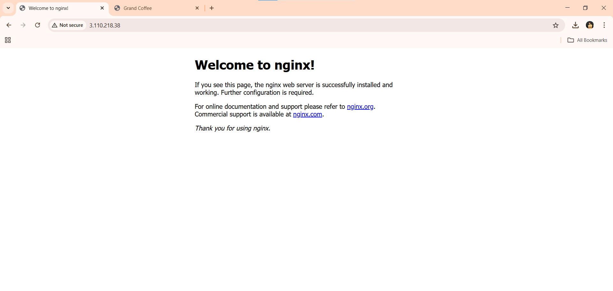


## Conclusion

We have successfully created an EC2 instance, configured it, installed software (Nginx), deployed an application, and accessed it from a browser. This guide demonstrated how to create a simple web server with an application running on it.


