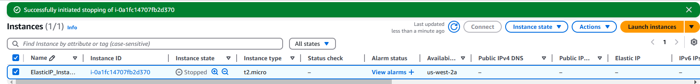

# Elastic IP and EC2 Instance Setup

This project demonstrates how to create an Elastic IP in AWS, attach it to an EC2 instance, and ensure that the public IP address remains constant even when the EC2 instance is stopped and started.

## Prerequisites

Before you begin, ensure you have:

1. An AWS account.
2. AWS CLI installed and configured.
3. Necessary permissions to create and manage EC2 instances and Elastic IPs.

## Steps to Implement

### Step 1: Launch an EC2 Instance

1. Log in to the [AWS Management Console](https://aws.amazon.com/console/).
2. Navigate to the **EC2 Dashboard**.
3. Click **Launch Instances** and provide the required details:
   - Select an AMI (e.g., Amazon Linux 2).
   - Choose an instance type (e.g., t2.micro).
   - Configure instance details and ensure you have a key pair for SSH access.
   - Configure Instance Network
4. Click **Launch** to create the instance.

 
 in the above image we can see its public ip as ***"44.244.218.225"***

  #### Test-1 : 
   - Turning off and turning on the instance and checking its public ip
  
  

   -  From the above picture, we Concluded that turning off and turning on the instance makes changes in public IP 
    i.e, from ***"44.244.218.225"*** to ***"35.88.64.4"***

  
### Step 2: Allocate an Elastic IP

1. Navigate to the **Elastic IPs** section under the EC2 Dashboard.
2. Click **Allocate Elastic IP address**.
3. Choose **Amazon’s pool of IPv4 addresses** and click **Allocate**.
4. Note down the Elastic IP address allocated.

### Step 3: Associate the Elastic IP with the EC2 Instance

1. Select the newly created Elastic IP address.
2. Click **Actions** → **Associate Elastic IP address**.
3. Choose the instance you launched earlier from the list.
4. Click **Associate** to attach the Elastic IP to the instance.

### Step 4: Verify the Elastic IP

1. Go back to the EC2 Dashboard and select your instance.
2. Verify that the **Public IPv4 address** matches the allocated Elastic IP.

  #### Test-2 : 
  - Stop and start the instance, then recheck the public IP. It should remain the same.

 

## Explanation

Elastic IP addresses in AWS allow you to have a static public IP address for your EC2 instance. This ensures that the IP remains consistent, even if the instance is stopped and restarted. This is especially useful for applications where a constant IP is required, such as hosting web applications or connecting to external systems.

## Notes

- Ensure that your Elastic IP is released when not in use to avoid unnecessary charges.
 #### Step
 
- before releasing make sure that Elastic ip is diassociated from EC2
- Instance automatically gets a Dynamic Public IP after diassociating the Elastic ip from EC2

 

- Elastic IPs are region-specific, so ensure you are in the correct region when managing them.

## Conclusion

By following the steps above, you have successfully created and attached an Elastic IP to an EC2 instance. This ensures a stable public IP address for your application.

