# EC2 Key Pair Management and SSH Access Project (AWS Console)

## Project Overview

This project demonstrates how to import a public key pair into your AWS account using the AWS Management Console, create an EC2 instance with that key pair, and access the EC2 instance from your local machine using SSH.

### Prerequisites

Before starting this project, ensure you have the following:

- **AWS Account**: Ensure that you have access to an AWS account.
- **SSH Client**: Ensure you have an SSH client installed on your local machine (e.g., OpenSSH on Linux/MacOS or PuTTY on Windows).
- **Key Pair**: You must have an SSH key pair for accessing the EC2 instance.

### Steps to Execute


#### 1. **Importing Public Key Pair into AWS**

1. Log into the [AWS Management Console](https://aws.amazon.com/console/).
2. Navigate to the **EC2 Dashboard**.
3. In the left-hand menu, click on **Key Pairs** under **Network & Security**.
4. Click on the **Import Key Pair** button.

    
      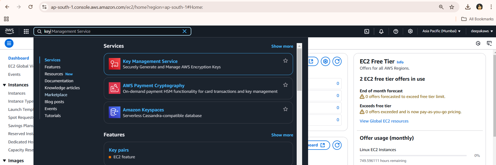
      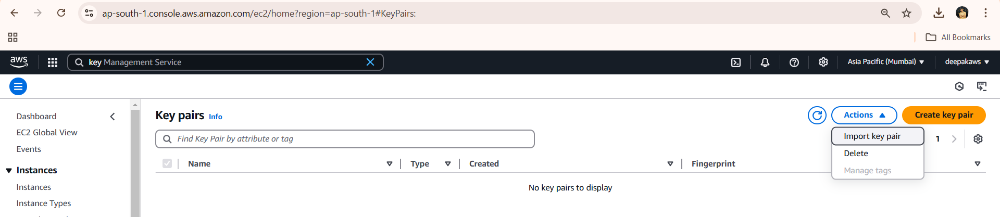


5. Enter a name for your key pair (e.g., `my-key-pair`).
6. Paste the contents of your public key (`.pub` file) into the **Public Key** field. If you don't have a public key, generate one on your local machine:
   - On Linux/MacOS, run:
     ```bash
     ssh-keygen -t rsa -b 2048 -f ~/.ssh/my-key
     ```
- This will be the content of public key in linux machine 
  
   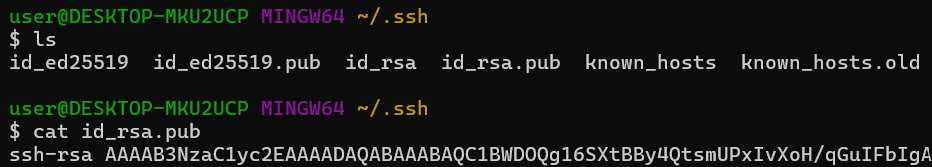

   - On Windows, use tools like PuTTYgen to generate the key pair.
7. Click **Import** to complete the key pair import process.

      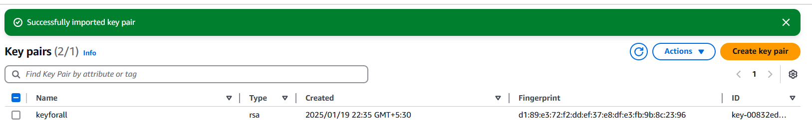

#### 2. **Creating an EC2 Instance with the Key Pair**

1. In the AWS Console, navigate to the **EC2 Dashboard**.
2. Click on **Launch Instance**.
3. Select an **Amazon Machine Image (AMI)** that fits your needs, for example, **Amazon Linux 2** or **Ubuntu**.
4. Choose an **Instance Type** (e.g., `t2.micro` for a free-tier instance).
5. In the **Key Pair** section, select the key pair you just imported (e.g., `my-key-pair`).
6. Configure any other settings as needed (e.g., security group rules for SSH access).
7. Click **Launch** to create your EC2 instance.

     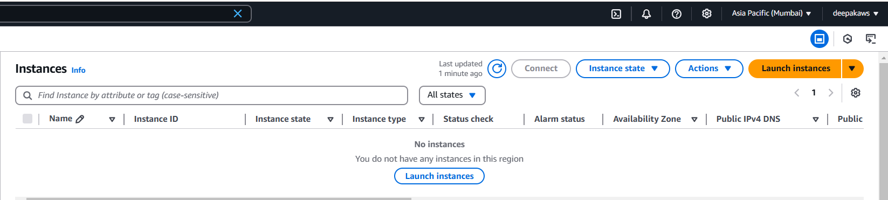
     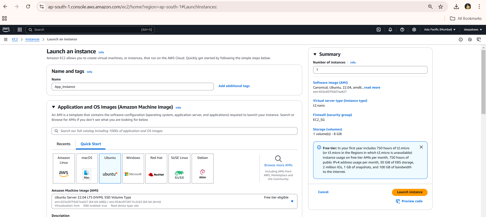
     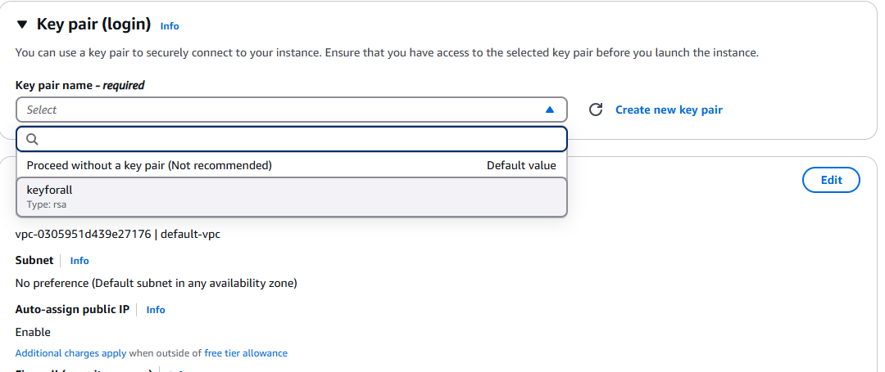
     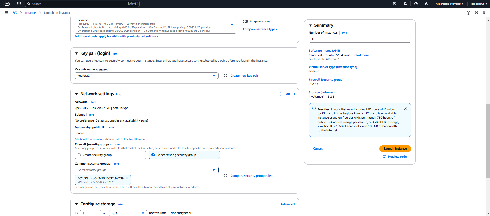
     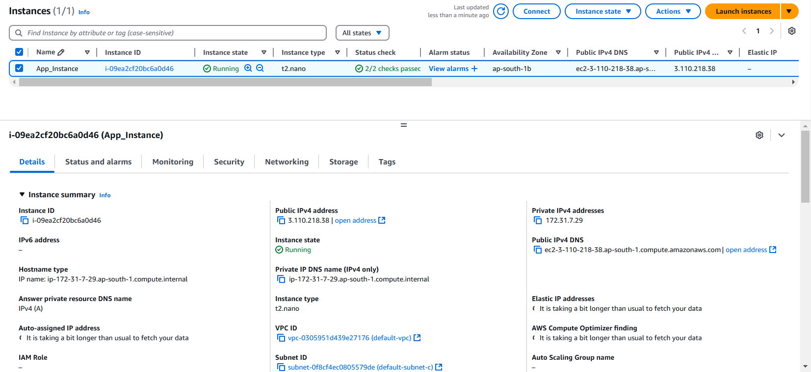
     

#### 3. **Accessing the EC2 Instance via SSH**

1. Once the EC2 instance is running, navigate to the **Instances** page in the EC2 Dashboard.
2. Select your EC2 instance and copy the **Public IP** address.
3. If you're on **Linux or macOS**, open a terminal and use the following command to SSH into the instance:
   ```bash
   ssh -i ~/.ssh/my-key ec2-user@<EC2_PUBLIC_IP>
   ```

   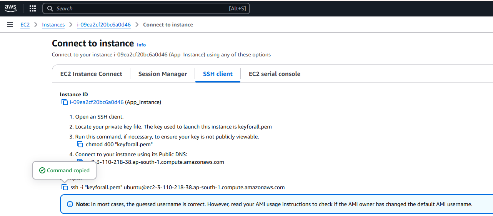
   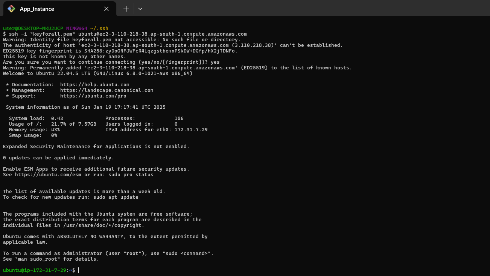

### Conclusion
By following the above steps, you've successfully:

- Imported a public key pair into AWS using the AWS Management Console.
- Created an EC2 instance using that key pair.
- Accessed the EC2 instance from your local machine using SSH.