# Creating a Custom VPC on AWS

This guide will walk you through the steps to create a custom VPC (Virtual Private Cloud) on AWS. We'll cover everything from setting up the basic infrastructure to launching instances within the VPC.

## Prerequisites

- An AWS account
- Basic understanding of AWS services

## Definitions

- **VPC (Virtual Private Cloud)**: A logically isolated section of the AWS cloud where you can launch AWS resources in a virtual network that you define.
- **CIDR (Classless Inter-Domain Routing)**: A method for allocating IP addresses and routing.
- **Subnet**: A range of IP addresses in your VPC. You can launch AWS resources into a specific subnet.
- **Internet Gateway**: A horizontally scaled, redundant, and highly available VPC component that allows communication between instances in your VPC and the internet. (Bi_Directional)
- **Route Table**: A set of rules, called routes, that are used to determine where network traffic is directed.
- **NAT Gateway**: A network address translation (NAT) service that enables instances in a private subnet to connect to the internet or other AWS services, but prevents the internet from initiating a connection with those instances.(One Directional)

## Steps to Create a Custom VPC

### 1. Log into the AWS Management Console

Go to [AWS Management Console](https://aws.amazon.com/console/) and log in.

### 2. Navigate to the VPC Dashboard

1. Search for "VPC" in the search bar.
2. Click on "VPC" under "Networking & Content Delivery".

   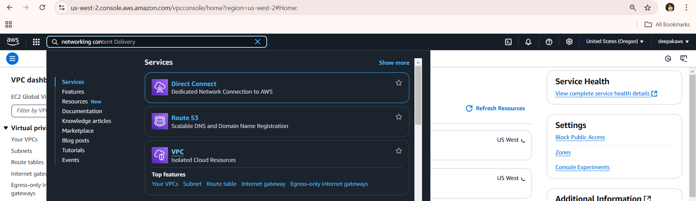

### 3. Create a New VPC

1. Click on "Create VPC".
2. Provide the following details:
   - **Name tag**: custom_VPC
   - **IPv4 CIDR block**: Specify a CIDR block (e.g., `10.0.0.0/16`).
   - **IPv6 CIDR block**: Optional.
   - **Tenancy**: Choose "Default.
3. Click "Create VPC".

   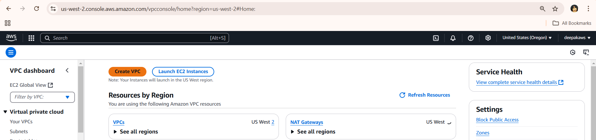
   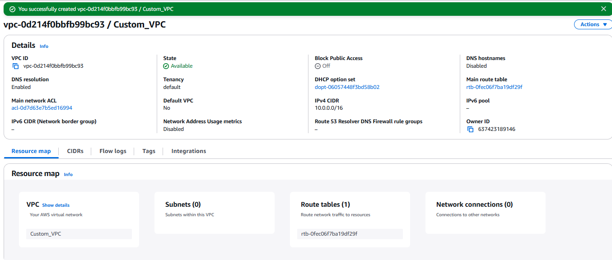

### 4. Create Subnets

1. Click on "Subnets".
2. Click "Create Subnet".
3. Provide details:
   - **Name tag**: Name your subnet.
   - **VPC ID**: Select your VPC.
   - **Availability Zone**: Choose a zone.
   - **IPv4 CIDR block**: Specify a CIDR block (e.g., `10.0.1.0/24`).
4. Click "Create Subnet".
5. Repeat for additional subnets.

   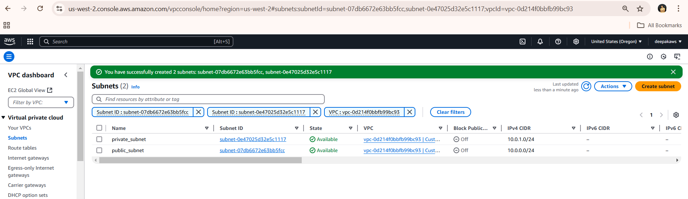

#### Note: 
* public & private subnets are just names given to subnets that aren't configured yet 

* Defaultly subnets are attached to Route Table which is created after creation of custom_VPC as shown in the picture below
* It means a route table is created after creation of Custom_VPC

   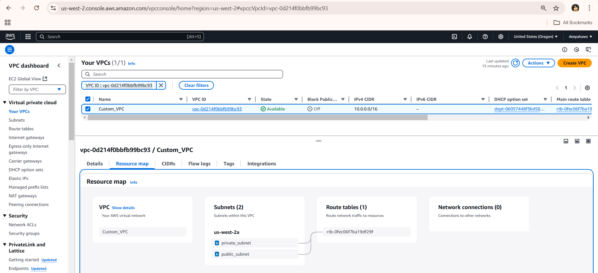

### 5. Create an Internet Gateway

1. Click on "Internet Gateways".
2. Click "Create Internet Gateway".
3. Name the gateway and click "Create".
4. Attach the gateway to your VPC:
   - Select the gateway.
   - Click "Actions" > "Attach to VPC".
   - Choose your VPC and click "Attach".

   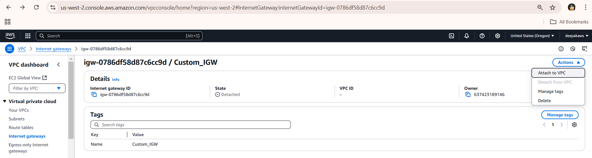
   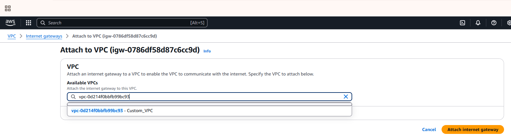

### 6. Configure Route Tables

#### Public Route Table

1. Click on "Route Tables".
2. Click "Create Route Table".
3. Provide details:
   - **Name tag**: PublicRouteTable
   - **VPC**: Select your VPC.
4. Click "Create".

   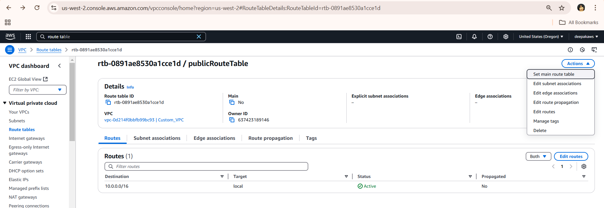

* To check how configuration is setup we can see it resource map.

   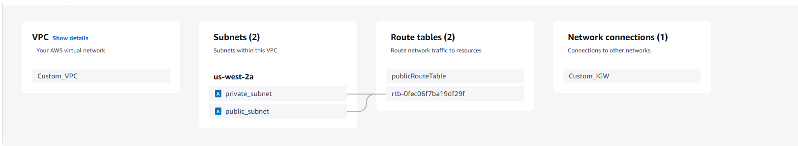

5. Associate with your public subnet:
   - Click "Subnet associations".
   - Click "Edit subnet associations".
   - Select your public subnet and click "Save".

   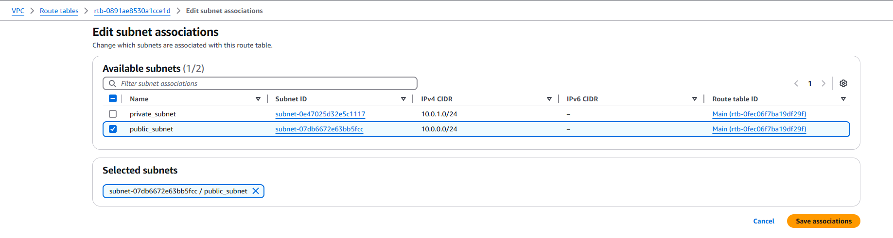
   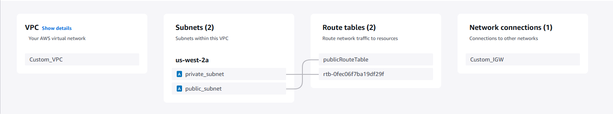

6. Select the route table and click "Routes".
7. Click "Edit routes" and add:
   - **Destination**: `0.0.0.0/0`
   - **Target**: Internet Gateway
8. Click "Save changes".

    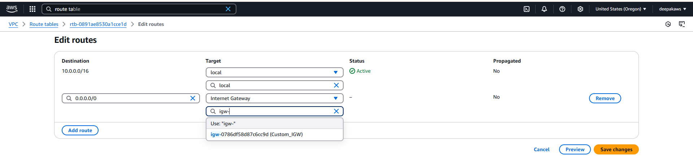
    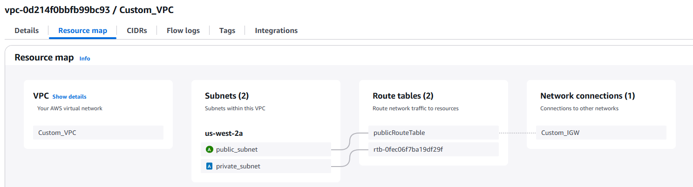

#### Notes:
 
 * 0.0.0.0/0 represents include the IP addresses only from reseptive subnets,it means we cannot replace 0.0.0.0/0 with your VPC IP address 

 * Route table is a subnet level assosication not with at VPC level 

#### Private Route Table

1. Create another route table for private subnets without an Internet Gateway route.
2. Name: privateRouteTable
3. Associate with private subnets.

   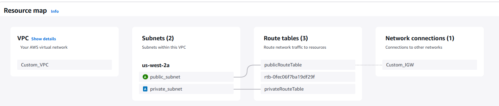

### 7. Create a NAT Gateway (Optional)

1. Click on "NAT Gateways".
2. Click "Create NAT Gateway".
3. Provide details:
   - **Name**: custom_NAT
   - **Subnet**: Choose a private subnet.
   - **Public**: enable
   - **Elastic IP**: Allocate new Elastic IP.
4. Click "Create NAT Gateway".

   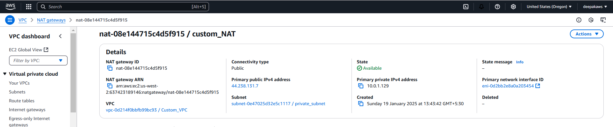

5. Update the private route table:
   - Add a route with destination `0.0.0.0/0` and target the NAT Gateway from drop down as shown in the figure.

   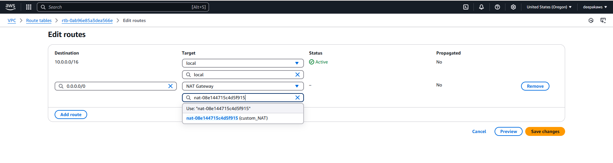

* After Configuration

    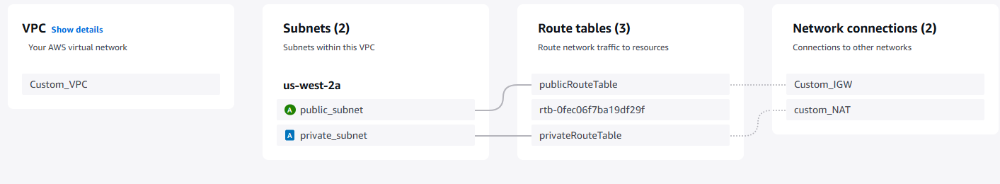

#### Notes:
* NAT Gateway needs a Elastic IP (Stable Public address)

### 8. Launch Instances in Your VPC

1. Navigate to the EC2 dashboard.
2. Click "Launch Instance".
3. Choose an AMI and instance type.
4. Configure instance details:
   - **Network**: Select VPC(Custom_VPC).
   - **Subnet**: Choose a Public subnet.
   - **Auto-assign Public IP**: Enable for public subnets.
5. select new.key pair from drop down
6. Add storage, tags, and configure security groups(Open for SSH , HTTP).
7. Review and launch the instance.

     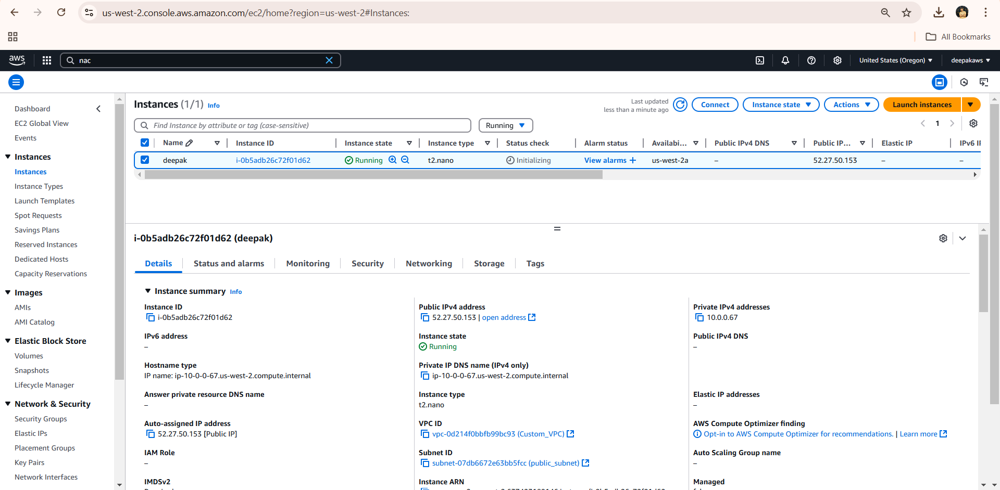

### Testing for inbound access  
    

   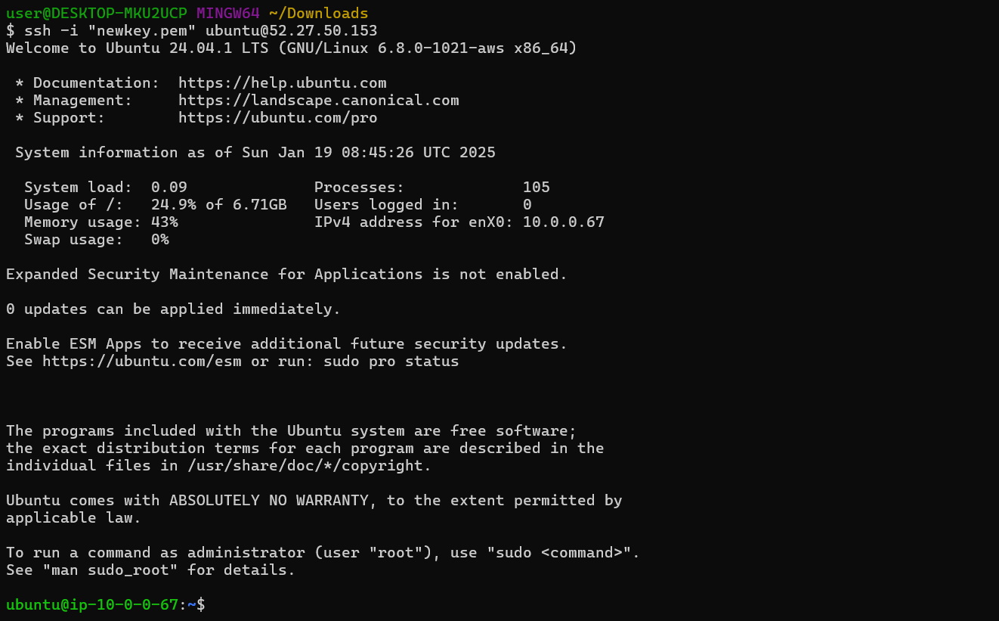

 

## Conclusion

We have successfully created a custom VPC on AWS. We can now manage and use our VPC to deploy resources securely.
