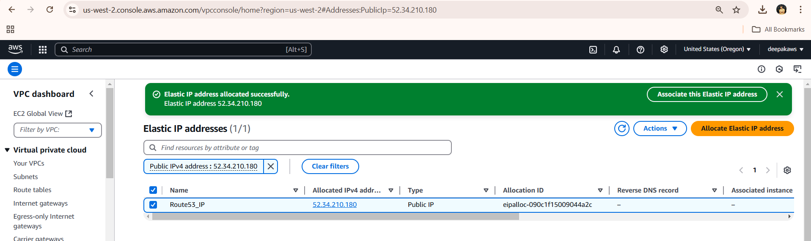
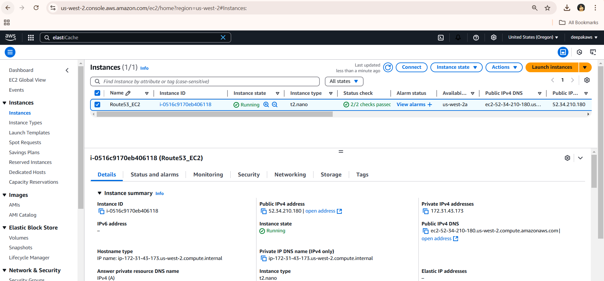
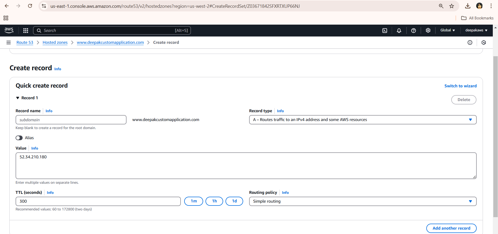
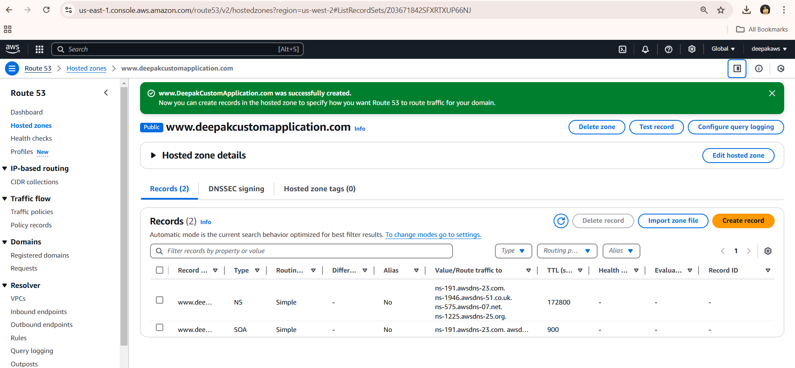

# Elastic IP, EC2 Deployment, and Route 53 Configuration

## Overview
This project involves the following steps:
1. Creating an Elastic IP in AWS.
2. Attaching the Elastic IP to an EC2 instance.
3. Deploying an application on the EC2 instance.
4. Configuring Route 53 to manage DNS.
5. Accessing the application via a DNS name.

## Prerequisites

- AWS Account
- IAM user with necessary permissions
- AWS CLI installed and configured
- Basic knowledge of EC2, Elastic IP, and Route 53
- SSH client for accessing the EC2 instance

## Step-by-Step Instructions

### Step 1: Creating an Elastic IP

**Reason**: Elastic IP addresses are static, public IPv4 addresses that can be associated with your AWS resources, allowing them to be reachable from the internet even if the underlying instance is stopped and restarted.

1. **Login to AWS Console**.
2. Navigate to **EC2 Dashboard**.
3. In the left navigation pane, choose **Elastic IPs**.
4. Click on **Allocate Elastic IP address**.
5. Choose the option to allocate an Elastic IP from Amazon's pool of IPv4 addresses.
6. Click **Allocate**.

### Step 2: Launching an EC2 Instance

**Reason**: EC2 instances provide scalable computing capacity. Launching an instance allows you to deploy and run your applications.

1. Navigate to the **EC2 Dashboard**.
2. Click **Launch Instance**.
3. Select an Amazon Linux Image (AMI).
4. Choose an instance type (e.g., t2.nano).
5. Configure instance details:
    - Number of instances: 1
    - Network: Select a VPC
    - Subnet: Select a subnet
6. Add storage and tags as needed.
7. Configure the security group:
    - Allow **SSH (port 22)** and **HTTP (port 80)**.
8. select keypair from your list which is imported already into aws account.
9. Review and launch the instance.

### Step 3: Attaching Elastic IP to EC2

**Reason**: Attaching an Elastic IP ensures that your EC2 instance has a static public IP address, which makes it easier to access and manage your application.

1. Navigate to **Elastic IPs** in the EC2 Dashboard.
2. Select the newly created Elastic IP.
3. Click **Actions** > **Associate Elastic IP address**.
4. Select the instance and network interface.
5. Click **Associate**.





**For detailed instructions on steps 1-3, refer to the separate project [here](https://github.com/DeepakVakkalaDevOpsMutliCloud/AWS_Cloud/blob/main/ElasticIP/ElasticIP.md)**.

### Step 4: Deploying an Application

**Reason**: Deploying an application on the EC2 instance allows you to make it accessible to users over the internet.

1. SSH into the EC2 instance using the key pair:
   ```bash
   ssh -i "keyforall.pem" ubuntu@ec2-52-34-210-180.us-west-2.compute.amazonaws.com
   ```
2. Update the package index and install necessary packages:
   ```bash
   sudo apt update -y
   sudo apt install -y nginx
   ```
3. Start and enable the Apache web server:
   ```bash
   sudo systemctl start nginx
   sudo systemctl enable nginx
   ```
4. Deploy your application (for example, a simple HTML file):
   ```bash
      cd /tmp
       wget https://www.free-css.com/assets/files/free-css-templates/download/page2/ost-magazine.zip
      sudo apt install unzip -y
      unzip ost-magazine.zip
      mv ost-magazine /var/www/html/deepak

   ```
  
Check whether the application is runnign or not 


 

### Step 5: Configuring Route 53

**Reason**: Route 53 is used for domain name registration and DNS routing. Configuring it allows users to access your application using a domain name instead of an IP address.

1. Navigate to the **Route 53 Dashboard**.
2. Click **Create Hosted Zone**.
3. Enter your domain name and click **Create**.
4. Click **Create Record Set**.
5. In the record set, enter the following:
    - Name: (leave blank for root domain or specify subdomain)
    - Type: A - IPv4 address
    - Value: Your Elastic IP address
6. Click **Create**.


7. It is mandatory to have Registered Domain Name berfore stepping into Hosted Zone category.
### Step 6: Accessing the Application via DNS

**Reason**: Accessing the application via DNS provides a user-friendly way to reach your application without needing to remember IP addresses.

1. Allow time for DNS propagation.
2. Open a web browser and navigate to your domain.
3. Verify that the application is accessible.

## Additional Information

- **Automating with AWS CLI**:
    - Allocate Elastic IP:
      ```bash
      aws ec2 allocate-address --domain vpc
      ```
    - Associate Elastic IP:
      ```bash
      aws ec2 associate-address --instance-id i-xxxxxxxxxx --allocation-id eipalloc-xxxxxxxxxx
      ```
    - More commands can be found in the AWS CLI documentation.

- **Using Terraform for Infrastructure as Code**:
    - Define resources for EC2, Elastic IP, and Route 53 in Terraform configuration files.
    - Use `terraform apply` to provision the resources.

## Troubleshooting

- Ensure security groups allow traffic on the necessary ports.
- Verify DNS records in Route 53.
- Check application deployment by accessing the EC2 instance.

## Conclusion
This project demonstrates how to set up an Elastic IP, deploy an application on EC2, and configure Route 53 for DNS management.
